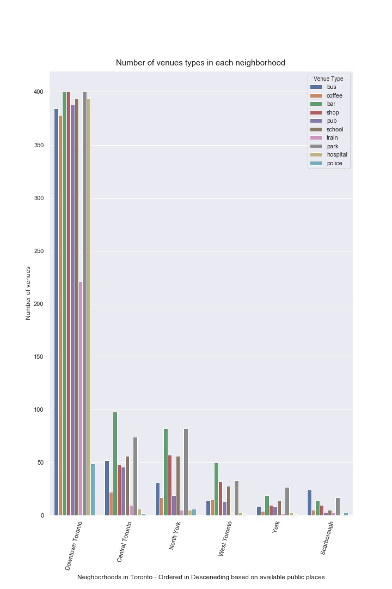
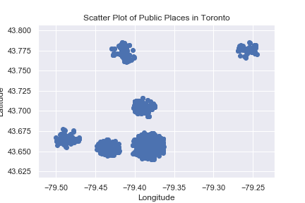

# Introduction

This report explains a python project done for IBM Coursera Capstone project for Machine Learning. I chose the problem of finding the best neighborhood in a city. The project is ambitious in a way, since to complete it it requires various public datasets in a city where the user wants to relocate to. For now, I have chosen to use the public venue information available in Fourdquare API based upon Crowdsourced information. 

# Project Description

**Finding a nice neighborhood to live in.**

Most adults during their life, have atleast made a single change of living location due to personal or professional reasons.  However finding a decent place where all the personal needs are met is highly stressful. Some people enjoy doing the detailed analysis by hand thereby figuring out following information like, 

1. the average rent in a neighborhood, 
2. transport amenities (both public and private), 
3. best schools for kids(if they have any, as this is a very important choice), 
4. average commute time from that neighborhood to work place, 
5. nearest hospitals, 
6. crime rates, 
7. police or communal violence,
8. political or racial tensions,
9. public health crisis in the last few years, 
10. tax rates
11. public places like parks,
12. places to have leisure sctivities like going to restaurants, movie theaters, saunas, gym, etc.,

These are few common things to consider during a relocation and they are very important for a healthy and stress free life. And doing an Online search for these is time consuming. In this project, we aim to meet atleast some common requirements like **parks, restaurants, bus termianls, coffee shops, bars, shopping malls, pubs, sschools, train stations, parks, hospitals, police stations**  and guide the project users to choose atleast 1 or more neighborhoods for their consideration during their relocation. By rating the neighborhoods based upon the available amenities they have, we can recommend the neighborhood in a city in a ranked order. This is the goal of this project. 

**Target Audience:-**  
Someone who wants to relocate to a city based on available public services.

**Stakeholders:-**
1. Someone who wants to relocate to a city.
2. Myself. 

# Data Description

We use public libraries and API's in this project. We use Wikipedia and FourSquare API, Some common Python Libraries for programming. 

### Wikipedia:-
From wikipedia pages, we can identify the neighborhood around the city. Every major cities have these information in their wiki page. We access the web page and then extract the neighborhood information. 

**Date Type:-**
XML and HTML

**Duration:-**  
< 10 seconds

**Description of the data:-**  
Location coordinates obtained by Geocoder calls.

**Source:-**
(https://en.wikipedia.org/wiki/Main_Page)

### Foursquare API:

Foursquare provides a valuable and publically accessible location information like the ameneties in  nearby locations. We use their developer tools to access the required information about the neighboords in a city. Using these accessed information we then rank the neighborhoods based on the ameneties they have. These services are free of charge. 

We create a Foursquare developer account, and after that we provide some zip codes inside a city and for each zip code or LatLon info(Latitude and Longitude Points) we provided we extract details on the ameneties we expect a neighborhood should have. So we set the radius of this search around to zip code to be around 1km. 

**Date Type:-**
JSON

**Duration:-**  
N/A

**Description of the data:-**  
Location coordinates obtained by Foursquare API calls.

**Source:-**
(https://foursquare.com/)

### Public Programming Tools:-
We use some public plotting tools like Folium to visualize the  neighborhoods in the city we want to relocate. Then based upon the analysis of the above combined information we can update the Folium visualization to reflect the number of amenities in a neighborhood. 

### K-Means Clustering Algorithm on the Data:-
We can use K-Means Clustering algorithm to group amenities in an area, then we can reduce the number of individual amenities comparisons to be done against each neighborhood. We can do these comparisons against the types of amenities, individually, collectively, or alltogether. 

# Data Analysis

## Finding Latitude and Longitude

1. After learning the neighborhood and its details, we prepare the address of each neighborhood and request Geolocator for their latitude and longitude in the following code. 
2. To verify the accuracy fo the latitude and the longitude values we call do reverse geolocation using the geocoder.

**Result:-**
We have found 67 neighborhoods in Toronto. The neighborhoods are redeuced to 6 districts in the final summary. 

## Using FourSquare for Finding the public places nearby the neighborhoods

1. For the 64 locations that we have found the LatLon values, we use foursquare to find the public places like coffee shops, bars, other shops, pubs, schools train startion, bus stations, parks , etc.

2. We use a radius of 1 KM for each neighborhood within which the foursquare api will return the above searched public spaces and their information. We search for atleast 200 such spaces in a neighborhood. 

3. The def get_category_type function analyses the values returned by the foursquare API and  filters the venue categories and find out if they matches the public space types that we are looking for.

**Reuslts:-**    
For the 67 neighborhoods we provided to Foursquare API, we received information on 4554 public places.

**Plots:-**
The following graph Visualizes- the Number of Venues Obtained by each type form the FourSquare API.

# Methods - Clustering

The above data obtained from Foursquare is now analyzed for figuring out the best neighborhoods among the recived data. For more information refer the ipython notebook in the Github folder as this file you are reading.

### Scatter Plot of all the venues in Toronto

## Visulaization of the Neighborhoods in Toronto Using Folium maps

## Visualizing public locations only in Downtown Toronto Neighborhood

Clustering the above locations using the k-Means Clustering algorithm yielded a clear set of 6 clusters as shown in the image below.

# Result
Downtown Toronto has more places in Toroto when compared to all remaining neighborhoods. So when a person wants to relocate based upon all the avilable public amenities they can recognize that Downtown Toronto is the best of all the avilable options. The above deductions is purely done based upon the quantity of the public amenities available and not on the quality of these servies. This is a drawback of the above project.

# Dicussion
1. The above project can be modified such that neighborhoods from various cities can be included. 
2. Furthermore, choosing a place to reside in the near future based upon the amount of public amenities doesn't guarantee peace of mind, or health in that case. More analysis on the quality fo these services provided can be useful for further analysis. 
3. The Limitation of the above project is due to the limits of the numebr of calls that can be made to the Foursquare API. 4. I'm planning to change the API call module to Google Places API, which impoves the number of call done from 950 to 10,000 per day. 

# Conclusion
This project was fun to work with, Now we can rank(based upon the quantity of public services available) the nighborhoods easily in the future when anyone has to relocate. 

# References
1. https://en.wikipedia.org/wiki/Main_Page
2. https://foursquare.com
3. https://jakevdp.github.io/PythonDataScienceHandbook/05.11-k-means.html
4. https://scikit-learn.org/stable/modules/generated/sklearn.cluster.KMeans.html
5. https://developers.google.com/places/web-service/intro
6. https://en.wikipedia.org/wiki/Toronto
7. https://en.wikipedia.org/wiki/List_of_neighbourhoods_in_Toronto
